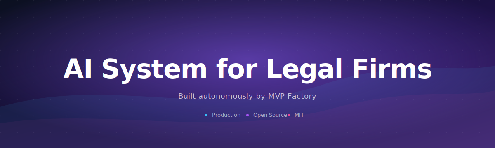
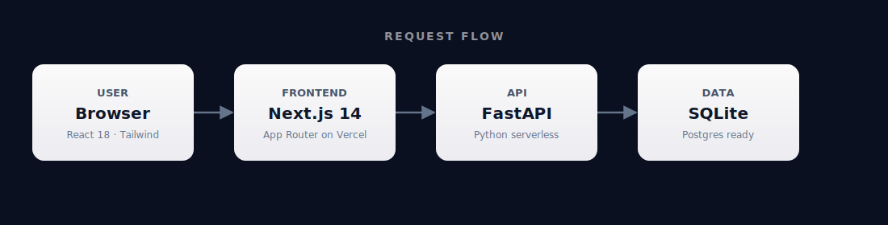
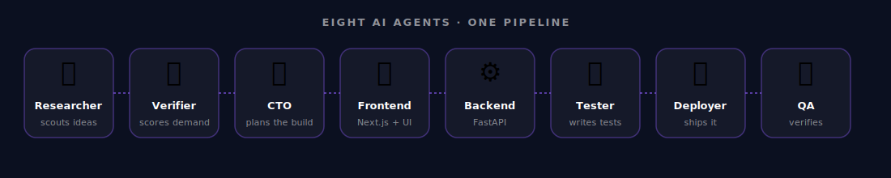

<div align="center">



# AI System for Legal Firms

### Custom AI SaaS for law firms - real case study showing €2,700 initial build + €1,300/month recurring revenue. 315 Reddit upvotes. Demonstrates specific vertical AI SaaS demand with proven recurring revenue model.

      

</div>

---

## What is this?

Custom AI SaaS for law firms - real case study showing €2,700 initial build + €1,300/month recurring revenue. 315 Reddit upvotes. Demonstrates specific vertical AI SaaS demand with proven recurring revenue model.

This repository was generated end-to-end by **[MVP Factory](https://github.com/malikmuhammadsaadshafiq-dev)** — eight specialized AI agents that research a real-world demand signal, design the system, write the code, test it, and ship it.

<br />

## Architecture

<div align="center">



</div>

A request flows from the browser into the Next.js frontend on Vercel, talks to a FastAPI service running as Vercel Python serverless functions, and reads or writes through SQLite locally — swappable to Postgres in production with a single connection string.

<br />

## How it was built

<div align="center">



</div>

Each agent owns one stage of the pipeline. They hand off work through a shared task board with no human in the loop.

<br />

## Quick start

```bash
git clone https://github.com/malikmuhammadsaadshafiq-dev/ai-system-for-legal-firms-2bbc
cd ai-system-for-legal-firms-2bbc
npm install
npm run dev
```

Open <http://localhost:3000> and you're in.

<br />

## Deploy

This project is wired up for one-click Vercel deploys — push to `main` and Vercel handles the rest. To deploy from your machine:

```bash
npm i -g vercel
vercel --prod
```

<br />

## License

MIT — generated autonomously by [MVP Factory](https://github.com/malikmuhammadsaadshafiq-dev).
